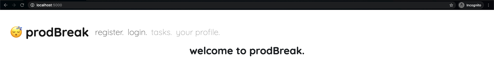

# ProdBreak

ProdBreak is a Python Flask based productivity web application for task management and break reminders.

## Requirements

It is highly recommended to create a virtual environment to run this application in. Follow the instructions [here](https://docs.python.org/3/library/venv.html) to create one.

Use the package manager [pip](https://pip.pypa.io/en/stable/) in the `prodBreak` directory to install the necessary requirements for ProdBreak to your virtual environment.

```bash
$ pip install -r requirements.txt
```
## Usage

In a terminal with your virtual environment activated, run the `run.py` program.

```bash
$ python3 run.py
```

In a Chrome or Firefox window, you can now navigate to `localhost:5000` to view the home page of the application.


## Roadmap
In the near future I plan on creating different profile pictures for the user to choose from, an option for them to add their own profile picture, and a password recovery feature, using the user's inputted email.

## Acknowledgement
To begin this project, I referred to [Corey Schafer's](https://www.youtube.com/channel/UCCezIgC97PvUuR4_gbFUs5g) Python Flask tutorials to refresh my knowledge of Flask and to learn how to integrate SQLAlchemy into this project.